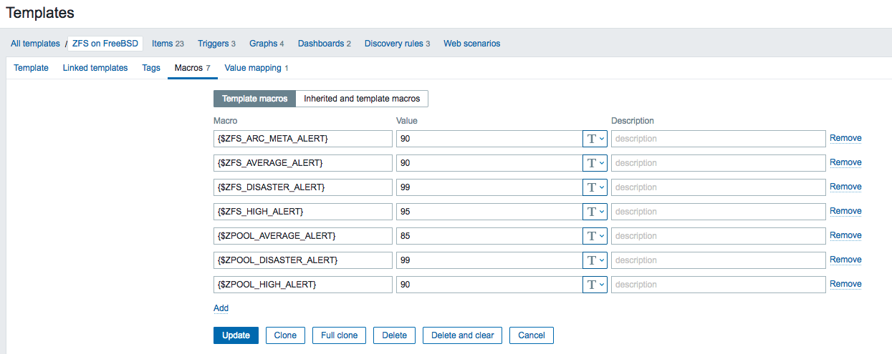
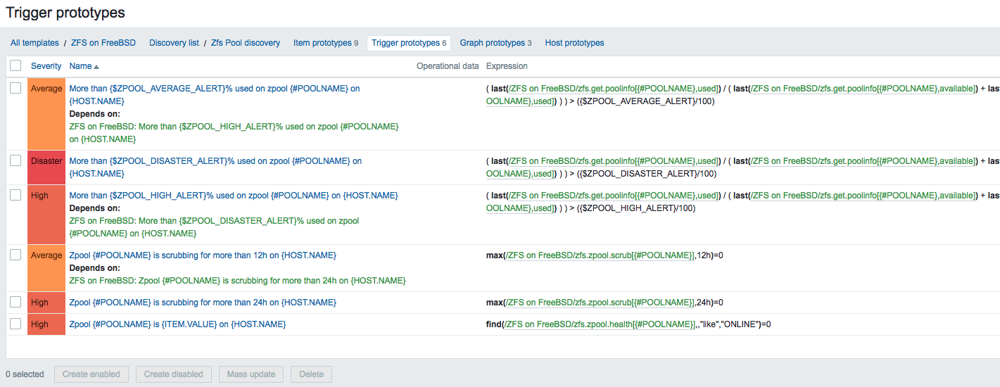

# Monitor ZFS on FreeBSD on Zabbix

This template is a fork of the project published to: https://github.com/Cosium/zabbix_zfs-on-linux

Template has the same feauteres of "zabbix_zfs-on-linux" but it works on FreeBSD.

# Supported FreeBSD version
FreeBSD 13 or later should works, tested on FreeBSD 13

# Installation on Zabbix server

## Import the template
Import the template that is in the "template" directory of this repository

# Installation on the server you want to monitor
## Prerequisites
The server needs to have some very basic tools to run the user parameters:
- awk
- cat
- grep
- sed
- tail
- coreutils (to install)

Most tools are already installed, and you need to install only "coreutils".

## Add the userparameters file on the servers you want to monitor

Put userparamters file "ZoL_freebsd.conf" on FreeBSD server to monitor. userparameters directory is usually located in `/usr/local/etc/zabbix54/zabbix_agentd.conf.d/`.
Note: remember to uncomment "Include" configuration option in `/usr/local/etc/zabbix54/zabbix_agentd.conf`

## Restart zabbix agent
Once you have added the template, restart zabbix-agent so that it will load the new userparameters.

# Customization of alert level by server
This template includes macros to define when the "low disk spaces" type triggers will fire.

By default, you will find them on the macro page of this template:

If you change them here, they will apply to every hosts linked to this template, which may not be such a good idea. Prefer to change the macros on specific servers if needed.

You can see how the macros are used by looking at the discovery rules, then "Trigger prototypes":

# Important note about Zabbix active items

Differently form "zabbix_zfs-on-linux" this template uses Zabbix items of type `Zabbix agent`.
